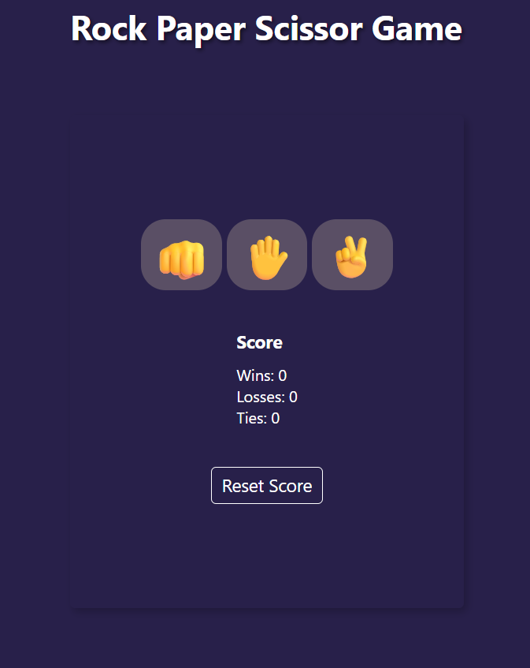

# Rock Paper Scissors Game

A simple and interactive **Rock Paper Scissors** game built using **HTML**, **CSS**, and **JavaScript**.  
Play against the computer and test your luck!

---

## 🎮 Features

- User-friendly interface
- Interactive gameplay
- Random computer choice generation
- Score tracking system
- Responsive design
- Smooth UI updates with JavaScript

---

## 🛠️ Technologies Used

- **HTML5** – Structure of the game
- **CSS3** – Styling and layout
- **JavaScript (ES6)** – Game logic and interactivity

---

## 📂 Project Structure

```bash
javaScript-mini-projects/
│
├── 01_project/
├── 02_project/
├── 03_rock_paper_scissor/
│   ├── index.html
│   ├── style.css
│   ├── script.js
│   └── README.md
│
└── more-projects/


🚀 How to Run the Project

-Clone the repository
    git clone https://github.com/PaSsIvE-learner-786/javaScript-mini-projects.git
-Open the project folder
    cd javaScript-mini-projects/03_rock_paper_scissor
-Run the game
    Simply open the index.html file in your browser.


🎯 Game Rules

-Rock beats Scissors
-Scissors beats Paper
-Paper beats Rock
-If both player and computer choose the same option, the game ends in a draw.


📸 Screenshot




💡 Future Improvements

-Add sound effects
-Add animations
-Add difficulty levels
-Multiplayer mode
-Dark/light theme toggle


🤝 Contributing

    Contributions are welcome!

-Fork the project
-Create your feature branch
    git checkout -b feature-name
-Commit your changes
    git commit -m "Add new feature"
-Push to the branch
    git push origin feature-name
-Open a Pull Request


📄 License

This project is licensed under the MIT License.

👨‍💻 Author

Made with ❤️ by PaSsIvE-learner-786 using HTML, CSS, and JavaScript.